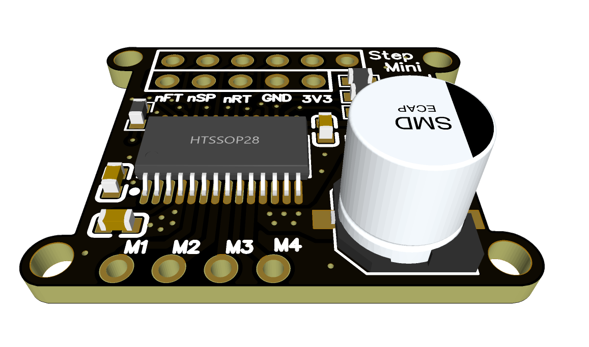
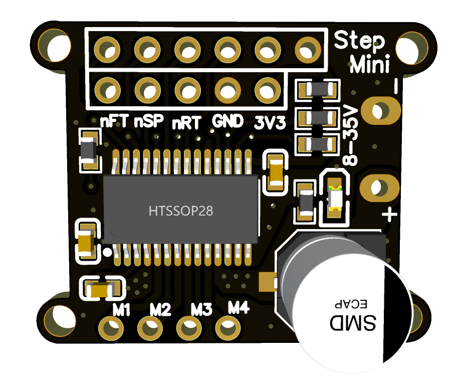
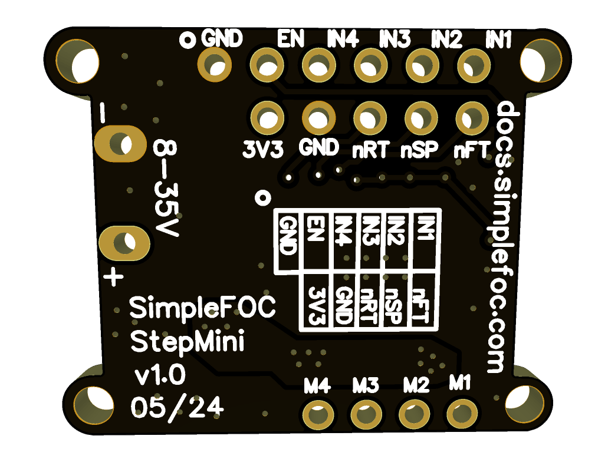
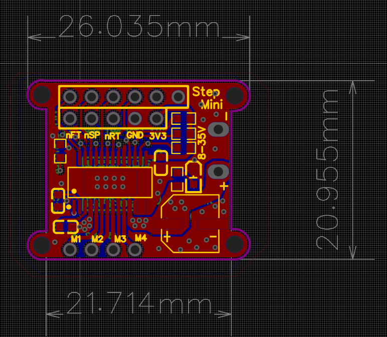

# SimpleFOC-StepMini <small>v1.0</small>

This is a miniature Stepper driver board based on the DRV8844 driver intended to be used with the *Simple**FOC*** library. This board is a part of the SimpleFOC Mini series of boards that are designed to be small, low-cost, and easy to use with the SimpleFOC library. It has the same footprint as the *Simple**FOC**Mini* board.

### Main features
- DRV8844 based - [datasheet](https://www.ti.com/lit/ds/symlink/drv8844.pdf)
    - Power supply: 8-35V
    - Max current: 2.5A per phase
    - Onboard 3.3V LDO 
        - up to 10mA 
        - can power a sensor like AS5600 or CUI AMT102 
- Small size 26x21 mm
  - same size as the *Simple**FOC**Mini* - [link to mini](https://github.com/simplefoc/SimpleFOCMini)
- Fully open-source: [EasyEDA link](https://easyeda.com/the.skuric/simplefocmini_copy)
- Low-cost: JLCPCB production cost ~3-5€
- Will be available in the [shop](https://www.simplefoc.com/shop) 10-15€

## Getting started with SimpleFOC StepMini

> The updated docs will be available soon!

See the documentation in the [SimpleFOC documentation](https://docs.simplefoc.com/simplefocmini) page. 
- The docs explain how to start with the *Simple**FOC**Mini* board and how to use it with the *Simple**FOC*** library. 
- They also describe how you can order it directly from the JLCPCB.

## Release log

Release | Date | Description
--- | --- | ---
v1.0 | 2024-05 | Initial release

## Size comparison

A simple size comparison between the *Simple**FOC**Mini* and the *Simple**FOC**-StepMini* boards.

